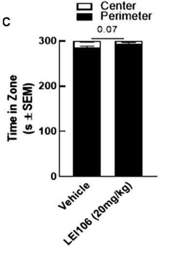
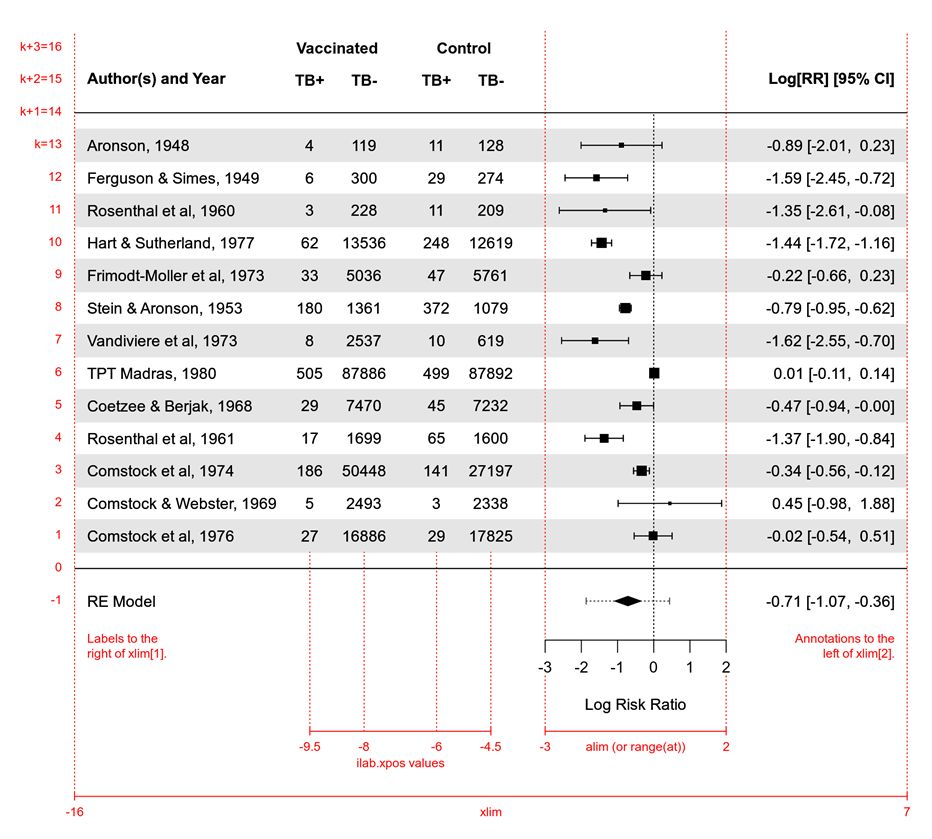

## Welcome to our course on how to run meta-analysis in R!

This is a R Markdown file: It combines plain text (and formulas, images, ...) and R code plus the code's output!
Don't hesitate to leave your own comments and the like in the spaces outside the red R chunks.

Hash tags ("#") are used to mark headings in Markdown. More hash tags: lower order headings.

You can either hit "Knit" on the top to get a HTML file of the whole Markdown file. Or you can execute R code selectively via "Run" (top right).


## Setting up

In this initial set-up we load the necessary packages. If you don't already have these packages installed, run the "install.packages" command which has been commented out.

Note that colored text following a hash symbol (#) in the code chunk is not read by R but simply provides a description of the code to make it easier to follow.

```{r setup, echo = TRUE, message=FALSE}
knitr::opts_chunk$set(echo = T,
                      results = "markup")

# install.packages(c("metafor", "ggpubr", "readxl", "janitor"))

library(metafor) # for meta-analysis
library(meta) # for meta-analysis
library(ggpubr) # general plotting
library(readxl) # loading data from Excel
library(janitor) # cleaning data
library(tidyverse) # general tidy data

# setting working directory to current folder
setwd(dirname(rstudioapi::getActiveDocumentContext()$path)) 

```


# 1 Data types and effect measures

In meta-analysis, we aim to aggregate across many studies. Typical output is a forest plot showing the individual study effects plus their statistical certainty (confidence interval, CI).

For quantitatively aggregating across many studies, we need:

* The same measure of effect for every study
* Uncertainty in the effect measure (standard error; 95%-CI; variance)

There are different data types (scales) that we might be interest in:

* Continuous measures (time, size, …)
* Binary / categorical outcomes (death, drop-out, therapy response, …)
* Time-to-event (survival, onset of disease, …)

Hence, we have different effect measures:

* Continuous: raw mean difference, standardised mean difference (SMD), normalised mean difference
* Binary: odds ratio, risk ratio
* Time-to-event: hazard ratio


# 2 Introduction to the working example & data set

__Centrofobic rats (in pain)__

(Note: __ makes bold text in Markdown.)

This data set is taken from a published systematic review titled "A systematic review and meta-analysis of thigmotactic behaviour in the open field test in rodent models associated with persistent pain", published in PLOS One in 2023, by Zhang and colleagues. For the full paper [please see PLOS One here](https://journals.plos.org/plosone/article?id=10.1371/journal.pone.0290382). 

This systematic review is investigating how rodents with persistent pain behave in the open field test. Therefore the main outcome in this data set is behaviour in the open field test. 


```{r}
DatTH <- as.data.frame(read_xlsx("Data Zhang Fig 2.xlsx")) # load data.

DatTH <- clean_names(DatTH) # clean variable names to get R-friendly ones
```


# 3 Extracting data

For calculating effect measures, we need to extract:

* sample sizes n
* group differences (e.g. means)
* variances (e.g. standard deviations, SDs)

(Note: * makes bullet lists in Markdown.)


## 3a Exercise

Extract data from Gerasimova et al. (2021) and add it to the Excel file (Data Zhang Fig 2.xlsx)

* First identify the relevant experiment / comparison
* Find means, SDs

Hints

* N = 15 in both groups
* The numbers are in the text 


# 4 Calculate Effect size: SMD

First, we will calculate an effect size for each experiment in the data set. An effect size is a measure of the difference between two experimental cohorts.

Behaviour is a continuous variable and we will calculate a Standardised Mean Difference, using the control (vehicle-treated) and the model induction (pain model) groups. 

First, we will calculate SMD effect sizes manually.

SMD formula: 

$$
SMD_i = \frac{\bar{x}_c - \bar{x}_{rx}}{S_{pooled}} \times \left(1 - \frac{3}{4N - 9} \right)
$$
(Note: The dollar sign ($) allows for including mathematical formula in Markdown.)

$$
S_{pooled} = \sqrt{ \frac{(n'_c - 1)SD_c^2 + (n_{rx} - 1)SD_{rx}^2}{N - 2} }
$$

$$
VAR = \frac{N}{n_{rx} \times n'_c} + \frac{SMD_i^2}{2(N - 3.49)}
$$


## 4a Exercise

Calculate effect sizes manually

* Pooled SD
* SMD
* Variance


### Pooled SD

First we calculate the pooled standard deviation.  

Then we examine the data set, to view the columns that contain the mean, standard deviation, and number of animals in the control and model groups:

```{r echo=TRUE, message=FALSE, warning=FALSE}

DatTH$pooledSD <- sqrt(((DatTH$ne - 1) * DatTH$se^2 + (DatTH$nc - 1) * DatTH$sc^2) / (DatTH$ne + DatTH$nc - 2))

head(DatTH[c("mc", "me", "se", "sc", "ne", "nc", "pooledSD")])

```

These 7 variables are the variables we will use to calculate the effect size. You view the variables to check that they contain the correct data.
 

### SMD

Now let’s calculate a SMD effect size for each experiment (saved as the variable “smd”) and add the effect size data as a new column in the DatTH data set. Remember, each variable in this equation is a list of numbers, with each entry corresponding to a single experiment.  

Again, we check that the new variable have been added correctly.

For exercise purposes, we have left out some R code and replaced it with "#...". Fill it in.

__(Important Note: In order to let your modified R code show up in the HTML file, you need to delete "eval=F" from the R chunks heading.)__

```{r eval=F}

DatTH$smd <- #...

head(DatTH[c("mc", "me", "se", "sc", "ne", "nc", "pooledSD", "smd")])

```


### Sampling Variance

We will now calculate the squared standard error for each experiment (and save this as a new variable “variance”).  

Again, we check that the new variable have been added correctly.


```{r eval=F}

# Sampling Variance

DatTH$variance <- #...

head(DatTH[c("mc", "me", "se", "sc", "ne", "nc", "pooledSD", "smd", "variance")])

```


### Plotting SMDs for spotting outliers

A box plot is a nice choice to spot nonsensical data.

```{r eval=F}
ggboxplot( #...
  ) 
```

... with study labels:

```{r eval=F}
ggboxplot(#...
          ) +
  geom_text(aes(label = DatTH$author[ifelse(DatTH$smd %in% boxplot.stats(DatTH$smd)$out, TRUE, NA)]), # label outliers
            na.rm = TRUE,
            nudge_x = 0.2)

```

When we go back to the original included study (Levine et al., 2020), we can see that this study has very small error bars, that are very hard to measure and lead to a unrealistically strong effect.




(Note: This is how you can include external images in Markdown. They have to be stored in the same folder as the .Rmd file.)


Box plot after exclusion of Levine et al. (2020):

```{r eval=F}
# filter out nonsense SMD and create new and final data set
DatTH2 <- DatTH[DatTH$smd < 1000, ]


ggboxplot(#...
          ) +
  geom_text(aes(label = DatTH2$author[ifelse(DatTH2$smd %in% boxplot.stats(DatTH2$smd)$out, TRUE, NA)]), # label outliers
            na.rm = TRUE,
            nudge_x = 0.2)


```


## 4b Exercise

Calculate effect sizes in metafor

Use the "escalc()" function to calculate the SMD effect sizes.

We use the "cbind()" function to take a table of data and binds a new column to the right side. Remember, each variable in this equation is a list of numbers, with each entry corresponding to a single experiment.

```{r eval=F}

DatSMD <- escalc(#...
           )

head(cbind(DatTH2[c("smd", "variance")],
           DatSMD))

```

__-> Description: metafor gives us the same SMDs like above (yi = smd), but with less code. E.g., compare -3.58 from the first study.__


# 5 Meta-analytical models

### Meta-analysis = Weighted average of effects

Logic: Weight study results by study specific uncertainty (size, SD, effect)
Studies get a larger weight, when:

* Larger N
* Smaller SD
* Larger group difference


### Random effects model

* REM is the standard nowadays and the default in metafor
* Estimator: Restricted maximum likelihood (REML), default in metafor
* Confidence intervals: Via method by Knapp-Hartung, set in metafor via test = "knha"


## 5a Exercise

Conduct a random effects meta-analysis.

* Use the "rma()" function
* Keep in mind to specify test = „knha“ 

Remember to use the data set output from the "escalc()" function above. It stores the SMDs in "yi", and the variances in "vi".

```{r eval=F}

meta1 <- rma(#...
            )
summary(meta1)


knitr::opts_chunk$set(fig.height = 13)  # increase figure height for NEXT plot(s)
```

__-> Description: The aggregated (average) SMD is -1.14, with a p < .001. I.e., mice in experimental groups showed way stronger thigmotactic behavior than controls do (LESS time in center). The outcome measure "thigmotaxis" seems to be sensitive for measuring pain.__


# 6 Forest Plot

A forest plot is a way to visualise the effect size and confidence interval for each individual study in a meta-analysis. 

There are lots of options to modify forest plots in metafor. Here are some graphical parameters to play with:




## 6a Exercise

Visualising results in a forest plot:

* Use the "forest()" function to create a basic forest plot for our MA.
* The order argument gives control over the sequence of studies
* The slab argument allows the inclusion of study labels

## The default version:

```{r eval=F}

forest(#...
      )

```

__-> Description: The forest plots summarises the studies with 95% CIs and the aggregated effect at the bottom. The studies are ordered by the observed effect size.__


## The advanced version:

```{r eval=F}

forest(
  # specify the meta-analysis to plot
  meta1,
  order = "obs",
  slab = DatTH2$author,
  # add extra columns with info on Ns
  ilab = cbind(DatTH2$ne,
               round(DatTH2$nc, 0)),
  # position of columns on x axis
  ilab.xpos = c(-8.5, -7.5),
  header = "Authors and Year",
  # specify the limits of the x-axis
  xlim = c(-16, 7), 
  # range on x axis where to print effects
  alim = c(-7, 3),
  # size of text
  cex = 0.8,
  # digits/rounding of numbers: two digits in eff sizes, one digit on x axis
  digits=c(2, 1))
# add heading
text(c(-8.5, -7.5),
     # define line in plot
     meta1$k+2, c("N e", "N c"),    
     cex = 0.8, 
  # specify the font size
     font = 2)

```


# 7 Heterogeneity

“Statistical heterogeneity manifests itself in the… [study] effects being more different from each other than one would expect due to random error (chance) alone” -- Cochrane Handbook

Heterogeneity = Unexpected amount of variation in effect sizes between studies (above the amount we would expect due to sampling error)

Measured via:

* Q-test statistic: p-value of a significance test (indicates statistically significant heterogeneity)
* $\tau^2$: raw variance from the random-effects model (all sources of variation! Hard to interpret due to abstract unit of measurement)
* $I^2$: how much of the total variability in the effect size estimates is due to heterogeneity among the true effects?

$$
I^2 = 100\% \times \frac{\hat{\tau}^2_{RE}}{\hat{\tau}^2_{RE} + s^2}
$$

Cochrane's rule of thumb on $I^2$:

* 0% to 40%: might not be important
* 30% to 60%:moderate heterogeneity
* 50% to 90%: substantial heterogeneity
* 75% to 100%: considerable heterogeneity


## 7a Exercise

Check the output on heterogeneity measures.

```{r eval=F}

meta1 <- rma(#...
             )
summary(meta1)
```

__-> Description: There is significant (Q-test) and substantial heterogeneity according to Cochrane (I² = 73%).__


## Adding info about heterogeneity to the forest plot:

```{r eval=F}

# helper function for plotting, taken from metafor website. No need to grasp this completely (unless you want to)
mlabfun <- function(text, x, ps) {
  list(bquote(paste(.(text),
                    "t(", .(formatC(x$k - 1, digits=0, format="f")),
                    ")=",
                    .(formatC(x$zval, digits=2, format="f")),
                    .(ifelse(x$pval<.001, "***", 
                             ifelse(x$pval<.01, "**",
                                    ifelse(x$pval<.05, "*" , "")))),
                    ", Q(", .(formatC(x$k - x$p, digits=0, format="f")), ") = ", .(formatC(x$QE, digits=2, format="f")),
                    .(ifelse(x$QEp<.001, "***", 
                             ifelse(x$QEp<.01, "**",
                                    ifelse(x$QEp<.05, "*" , "")))),
                    ", ",
                    I^2, " = ", .(formatC(x$I2, digits=0, format="f")), "%, ",
                    tau^2, " = ", .(formatC(x$tau2, digits=2, format="f")))))}

forest(meta1,
       order = "obs",
       slab = DatTH2$author,
       ilab = cbind(DatTH2$ne,
                    round(DatTH2$nc, 0)),
       ilab.xpos = c(-8.5, -7.5),
       header = "Authors and Year",
       xlim = c(-16, 7), 
       alim = c(-7, 3),
       tck = 0.01,
       cex = 0.8,
       digits=c(2, 1),
       mlab = mlabfun("RE model: ", meta1, c("***", ""))) # adding function: Some Text, meta object, stars for p values
text(c(-8.5, -7.5), 
     meta1$k+2, c("N e", "N c"),    
     cex = 0.8, 
     font = 2)


knitr::opts_chunk$set(fig.height = 6)  # increase figure height for NEXT plot

```


# 8 Exploring Heterogenity - Meta-Regression

* Using regression analysis to evaluate the relevance of these study-specific features for the found effect
* The variables are also called “moderators” of the effect

A linear regression is described by:

* An equation for the line: $\hat{y} = a + b \times x$
* R² as measure of quality: How much variance in y can be predicted by x?
* I² is also a variance proportion!
* -> How much variance (I²) can be explained by the moderator?


## 8a Exercise

Run a meta-regression

* rma(), once again
* Adding a moderator: year of publication


Exploring the effect of year:

```{r eval=F}

DatSMD$year <- DatTH2$year # add year variable to metafor object

metareg <- rma(#...
              mods = ~ year
              )
summary(metareg)
```

__-> Description: Year as a moderator has an effect of -0.0564: Each year closer to the present increases the (already negative) mean SMD by 0.0564 (i.e., 10 years reduce the SMD by 0.564, which is substantial!). This is statistically significant (p = 0.0268). This moderator explains 6.64% of the heterogeneity (look for the $R^2$).__


## Plotting Meta Regression

We can plot the meta-regression with a continuous variable with the function "regplot()". We can simply provide the meta-regression object (and can do some plotting refinements). 

```{r eval=F}

regplot(# ...
        )

# adding regression line
abline(# ... 
       # line thickness
       lwd = 3)  

# adding numbers to the plot
text(2008, 1.5,  # x and y coordinates
     # text
     expression("slope SMD = -0.056*"),
     # position of text: right of the coordinates
     pos=4) #

knitr::opts_chunk$set(fig.height = 16)  # increase figure height for NEXT plot

```

__-> Description: The bubbles mark the studies (the greater the bubble, the greater the study weight). The regression line is augmented by a 95%-CI area in grey (-> studies before 2010 did not have a significant SMD on average).__


## Exploring heterogenetiy - 'Sex' as a moderator

Male and Female rats had a significant difference:

```{r eval=F}

DatSMD$sex <- DatTH2$sex
metareg2 <- rma(yi,
               vi,
               mods = ~ sex, 
               data = DatSMD)
summary(metareg2)


## forest plot with subgroups

# main plot
forest(metareg2, 
       # leave out overall meta-analysis result at the bottom
       addfit = F,
       # add some rows to the overall height of the plot
       ylim=c(-1.5, meta1$k+8),
       # indicate some rows to spare for adding sub group results (left out rows are spared)
       rows = c(95:82, 77:2),
       # the usual stuff:
       slab = DatTH2$author,
       refline = 0,
       ilab = cbind(DatTH2$ne,
                    round(DatTH2$nc, 0)),
       ilab.xpos = c(-8.5, -7.5),
       header = "Authors and Year",
       xlim = c(-16, 7), 
       order = DatTH2$sex,
      
       alim = c(-7, 3),
       tck = 0.01,
       cex = 0.8,
       digits=c(2, 1),
       mlab = "")
text(c(-8.5, -7.5), 
     meta1$k+8, c("N e", "N c"),    
     cex = 0.8, 
     font = 2)

# calculate sex specific meta-analyses
metaMale <- rma(yi, vi, 
                # specify subgroup
                subset=(sex=="Male"), 
                data=DatSMD)
metaFemale <- rma(yi, vi, 
                  # specify subgroup
                  subset=(sex=="Female"), 
                  data=DatSMD)

# add headings + diamonds
addpoly(metaMale, 
        # in which row?
        row = 1,
        # apply function for printing more info on model
        mlab=mlabfun("RE Model for Males ", metaMale), 
        col="royalblue4")
addpoly(metaFemale, 
        # in which row?
        row = 79,
        # apply function for printing more info on model
        mlab=mlabfun("RE Model for Females ", metaFemale), 
        col="royalblue4")


knitr::opts_chunk$set(fig.height = 5) 

```


## A bar plot to visualise the meta-regression with binary variables:

```{r eval=F}

# prepare sex meta-analysis data for plotting (tidyverse-style code)
metaRegSex.p <- predict.rma(metareg2, addx = TRUE)
sex <- as_tibble(metaRegSex.p)%>% group_by(X.sexMale)
sex.s <- sex %>% summarise(
  Male = mean(X.sexMale),
  es = mean(pred),
  se = mean(se),
  ci.lb = mean(ci.lb),
  ci.ub = mean(ci.ub))
sex.s <- sex.s %>% 
  mutate(Male=replace(Male,Male==0, "Female"),
  Male=replace(Male,Male==1, "Male"))
N <- (DatTH2$ne + DatTH2$nc)
oft_sex <- cbind(DatSMD, N)
sex.n <- DatTH2 %>% 
          group_by(sex) %>%
          summarise(
          sum.N = sum(n_total))

# bar plot
ggplot(data=sex.s, 
       aes(x=Male, y=es)) +
  # grey CI of overall effect
  geom_rect(xmin=0.4, 
            xmax=2.6, 
            ymin = meta1$ci.lb, 
            ymax = meta1$ci.ub,
            alpha=0.2) +
  # overall effect
  geom_hline(yintercept = meta1$beta) +
  # sec specific bars
  geom_bar(data=sex.s, 
           aes(x=Male, y=es),
           color = "cadetblue4", 
           fill = "cadetblue", 
           width = c(sqrt(sex.n$sum.N[1])*0.02, sqrt(sex.n$sum.N[2])*0.02),
           stat = "identity") +
  # bar CIs
  geom_errorbar(data=sex.s, 
                aes(x = Male, ymin = ci.lb, ymax = ci.ub),
                width=0.1, 
                colour="cadetblue4", 
                alpha=0.9, 
                size=1) +
  # some general settings for the plot
  theme(panel.grid.major = element_blank(), 
        panel.grid.minor = element_blank(),
        panel.background = element_blank(), 
        axis.line = element_line(colour = "black"),
        axis.title.x = element_text(margin = margin(t = 0, b = 20), size = 16),
        axis.title.y = element_text(margin = margin(r = 20), size = 16),
        axis.text.x= element_text(size = 14),
        axis.text.y= element_text(size = 14)) + 
  # labels
  labs(x = "", y = "SMD",
      caption = "The horizontal grey bar represents the 95% CIs of the global estimate.
         The width of the bars is proportional to the number of animals in each subgroup.")  

```


## 8b Exercise

Run meta-regression for the strain variable.

```{r eval=F}

DatSMD$strain <- #....
metareg3 <- rma(#...
                )
summary(metareg3)

knitr::opts_chunk$set(fig.height = 6)  # increase figure height for NEXT plot

```

__-> Description: No significant impact of strain on the SMD. Not statistically significant and no relevant $R^2$.__


# 9 Detecting Small Study Effects (Publication bias)

### Funnel plot

Funnel plot: Effect size plotted against the standard error (SE).

When using the SMD, they are susceptible to distortion, leading to overestimation of the existence and extent of publication bias [(Zwetsloot et al., 2017)(https://doi.org/10.7554/eLife.24260). We therefore recommend plotting funnel plots where SMD is the effect size, against a sample size-based precision estimate. 


## 9a Exercise

Create a funnel plot for our meta-analysis.

* Overwrite the default and use an inverse of N: yaxis = "sqrtninv" 


```{r eval=F}

funnel_plot <- funnel(#...
                      )

```


## Funnel plot asymmetry

In addition to assessing the funnel plot visually, we can test for asymmetry statistically. Here we will use Egger’s test, which is a weighted linear regression of the treatment effect on its standard error.


## 9b Exercise

Calculate an Egger‘s regression
* regtest()
* Add the line to the funnel (code is prepared)


```{r eval=F}
reg <- regtest(#...
        # specify the predictor to use for the regression test
        predictor="sqrtninv")

reg


# funnel plot with regression line
funnel_plot <- funnel(
      # specify the meta-analysis to plot
       meta1,
       xlab = "Standardised Mean Difference (SMD)",
       # for getting nice y axis label
       ylab = expression(sqrt(1/n)), 
       # specify the measure plotted on the y axis, "sqrtninv", ie the square root of the inverse of N
       yaxis = "sqrtninv", 
       # specify the title
       main = "Funnel Plot")

# generate some values for the y axis (just so R knows where to plot stuff)
yvalues <- seq(0, 2.5, length=100) 
# add Eggger's regression line
lines(coef(reg$fit)[1] + coef(reg$fit)[2]*yvalues, # reads the regression result
      yvalues, 
      lwd=2)

```

__-> Description: No statistically significant asymmetry can be found (p = 0.8890). Egger's regression line is almost vertical.__


## Trim and Fill 
We can also estimate and adjust for the number and outcomes of theoretically missing studies in a meta-analysis, using a method called trim and fill. We can test for and impute missing studies using the function "trimfill()":

```{r eval=F}
thigTrim1 <- trimfill(meta1)           

# view the results of the trim-and-fill analysis
thigTrim1 
```

__-> Description: No asymmetry, as no studies (0) need to be filled in.__

As there is not much happening in our case - let's tweak the data a bit for the purposes of this teaching workshop only

```{r eval=F}

meta2 <- rma(yi,
             vi,
             # filter out studies with an effect above -2
             data = DatSMD[DatSMD$yi < -2,], 
             test = "knha"
)
summary(meta2)

thigTrim2 <- trimfill(meta2)

# view the results of the trim-and-fill analysis
thigTrim2 
```

__-> Description: We succeeded in biasing the MA's result by systematically deleting studies (average SMD = -2.69!). Trim & fill tells us, there now is asymmetry and 4 studies on the right are missing to balance it out.__

You can draw a funnel plot of the filled data using the function "funnel()":

```{r eval=F}
thigTrimFun <- funnel(thigTrim2,
  # specify the x axis label
  xlab = "SMD", 
  # specify the measure plotted on the y axis, "sqrtninv", ie the square root of the inverse of N
  yaxis = "sqrtninv"  
)

```

__-> Description: The gap of studies that we deliberately introduced is filled in and thus indicates asymmetry.__
